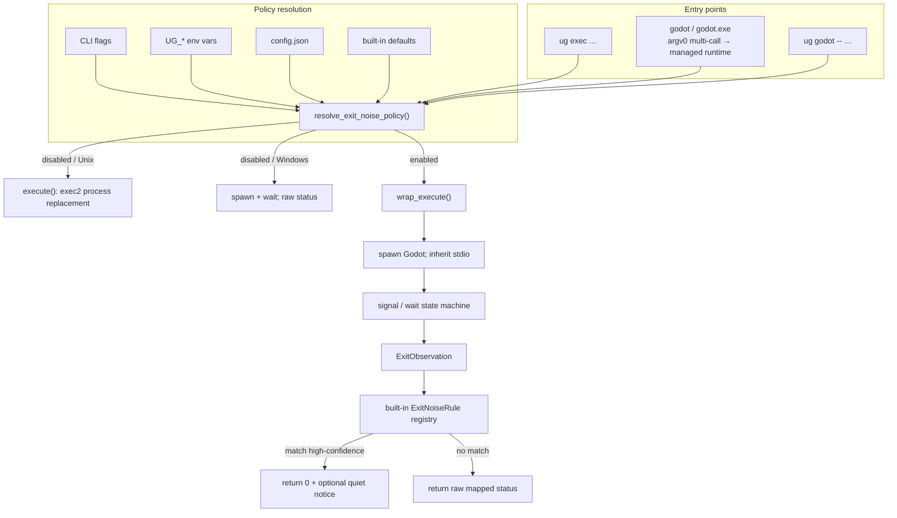

# Design: Tolerate Known Godot Exit Noise

| Field | Value |
| --- | --- |
| **Document** | Tolerate known Godot exit noise (false crash filter) |
| **Author** | TBD |
| **Date** | 2026-07-18 |
| **Status** | Partially implemented (rev 8) |
| **Issue** | `ug-dzk` |
| **Audience** | Implementers of `ug` (use-godot) |

### Shipped vs deferred

| Area | Status |
| --- | --- |
| Opt-in wrap for `ug exec` only | **Shipped** |
| CLI / env / machine `$UG_ROOT/ug.toml` / project `ug.toml` chain | **Shipped** |
| Legacy `config.json` → `ug.toml` migration (locked config cmds) | **Shipped** |
| Stable rules: headless SIGABRT+`--quit*`; stack-chk+PID correlator | **Shipped** |
| Multi-call managed runtime / shim rebind on `config set` | **Deferred** |
| Unix signal forwarding wrapper → Godot | **Deferred** |
| Doctor config↔shim checks | **Deferred** |
| `godot` shim mediation when tolerate is on | **Deferred** (shim remains direct link) |

Treat README and `docs/architecture.md` as source of truth for shipped behavior;
sections below that describe multi-call runtime remain design intent for follow-ups.

---

## Overview

Godot (and the Godot + GDExtension stack) sometimes aborts with a **known, unfixable, consequence-free** crash that still produces a non-zero exit status and an OS crash report. A concrete primary target (user-confirmed) is the **stack-canary abort** path: `__stack_chk_fail` → SIGABRT with ASI `stack buffer overflow`, observed during EOS binding (`IEOS::_bind_methods` in `libeosg`). Whether one labels that “engine” or “extension,” the product need is the same: an **opt-in, precise, fail-closed exit policy** that reclassifies *that* exit as success without swallowing unrelated legitimate crashes, and **without** disabling crash handling for the general case.

This design introduces **wrap-mode execution** (parent process remains alive), a **built-in exit-noise rule registry**, and a small **user configuration surface** so the feature can be enabled per invocation, via environment, or as a default. When the feature is off, Unix `ug exec` keeps today’s `exec(2)` semantics and the managed `godot` shim remains a direct filesystem link to the selected binary. When the feature is on, `ug` becomes the parent, applies a **narrow, multi-conjunct** rule match to the child’s wait status and process context, and returns a rewritten exit code only when a rule matches with high confidence.

**Revision 2** hardens three areas called out in review: (1) Windows multi-call publication via a **managed runtime binary under `$UG_ROOT`** (same-volume hard links), (2) a **non-blanket** first rule (headless `--quit*` conjunct for stable TreatAsSuccess; GUI teardown rule experimental / not default-stable), (3) implementable **policy truth table** and **signal-forwarding state machine**.

**Revision 3** fixes multi-call behavior when **effective** tolerate is forced off via env while **configured** tolerate keeps the shim on the managed runtime (direct-exec Godot; not fatal desync).

**Revision 6** removes crash-handler inject / dialog muting entirely: feature is **exit-code rewrite only**; legitimate crashes keep default presentation.

**Revision 7** accepts the user’s full macOS report as the **primary known-noise signature** to tolerate (not “wrong bug class”). Matching is multi-conjunct and fail-closed; crash UI remains unsuppressed.

---

## Background & Motivation

### Current execution model

From `docs/architecture.md` and `src/main.rs`:

| Path | Unix today | Windows today |
| --- | --- | --- |
| `ug exec` | `Command::exec()` — Godot **replaces** `ug` (same PID, terminal, signals, job control) | Spawn + wait; return child exit code |
| Managed shim (`shims/godot`) | Direct symlink via `atomic::replace_symlink` → selected binary | Direct hard link to selected binary |
| Invoking `godot` | **Does not** run `ug` | **Does not** run `ug` |

```378:395:src/main.rs
#[cfg(unix)]
fn execute(binary: &std::path::Path, args: &[String]) -> Result<u8> {
    use std::os::unix::process::CommandExt;

    let mut command = Command::new(binary);
    command.args(args);
    let error = command.exec();
    Err(error).with_context(|| format!("execute {}", binary.display()))
}

#[cfg(not(unix))]
fn execute(binary: &std::path::Path, args: &[String]) -> Result<u8> {
    let status = Command::new(binary)
        .args(args)
        .status()
        .with_context(|| format!("execute {}", binary.display()))?;
    Ok(status.code().unwrap_or(1).clamp(0, 255) as u8)
}
```

```156:171:src/state.rs
fn apply_activation(
    paths: &Paths,
    state: &mut State,
    installation: &Installation,
    set_default: bool,
) -> Result<()> {
    let canonical = installation.identity.canonical();
    atomic::replace_symlink(&installation.binary, &paths.shim())?;
    // ...
}
```

```120:125:src/atomic.rs
// Managed installations and shims share a filesystem, so a hard link avoids
// the elevated privilege Windows requires for symbolic links.
fs::hard_link(target, link).with_context(|| format!("create hard link {}", link.display()))
```

Implications:

1. On Unix, **there is no parent** after a successful `exec(2)`, so exit status cannot be reinterpreted unless we deliberately stop using process replacement when the feature is on.
2. The managed shim is intentionally **not** a `ug` indirection (`docs/architecture.md`: “invoking it does not run `ug`”). A default-on filter that only works for `ug exec` is half a product for users who type `godot`.
3. `State` (`src/state.rs`) holds only aliases / default / active — **no general user config file** exists yet. `.ugrc` is project pin only (`src/project.rs`).
4. Integration tests encode today’s Unix PID-preservation contract (`tests/cli_contract.rs::exec_replaces_ug_and_preserves_the_process_id`). Wrap mode must be an **explicit exception**, not a silent global behavior change.
5. Windows shims are **hard links within `$UG_ROOT`**. Pointing the shim at an install-time `current_exe()` outside the managed root violates that invariant and fails across volumes; upgrades also create new inodes and stale hard links. Multi-call must publish a **managed runtime** under `$UG_ROOT` (see §B).

### Pain points

1. **Non-zero exit after “success”** — CI scripts and shell pipelines treat the session as failed.
2. **Crash dialog UX** — macOS Crash Reporter / Windows WER / Godot’s own crash handler can interrupt interactive workflows even when the session was a normal quit.
3. **Cannot blanket-suppress** — Real SIGSEGV/SIGABRT mid-run, GDExtension unload bugs, and genuine editor failures must remain visible and non-zero.

### Known engine noise landscape (context, not v1 scope)

- Teardown abort after clean quit (target of v1 rules, with narrow conjuncts).
- ObjectDB leak *warnings* on exit (`WARNING: ObjectDB instances leaked at exit`) — often stderr noise without a crash; out of scope for v1 exit rewriting.
- Real close-time crashes (audio server, language teardown, GDExtension unload) — **must never** be filtered by a broad rule.

---

## Goals & Non-Goals

### Goals

1. Optional wrap of Godot so `ug` can apply a **precise, fail-closed** exit-status policy (every shipped TreatAsSuccess rule has **≥2 independent conjuncts**, not signal alone).
2. Opt-in flag plus ability to make wrap/filter **default-enabled** via config; env override for CI.
3. Preserve practical identity with direct Godot execution when wrapping: inherited stdio, argv, cwd, env; best-effort signal forwarding.
4. Extensible **built-in** rule registry so future known engine noise can be added without redesign.
5. Cover **`ug exec` and managed `godot` shim** when the user enables default wrap — on **all supported platforms**, including Windows via managed runtime.
6. Scriptable: filtered false crashes → exit `0`; unmatched / real failures → original non-zero status.
7. Testable without a real crashing Godot; injectable roots; no privilege escalation.

### Non-Goals (v1)

1. Fixing Godot engine bugs, GDExtension bugs, or reverse-engineering all aborts.
2. A general log scrubber / interactive TTY stderr mutator.
3. User-authored rule files (advanced / later; high risk of hiding real crashes).
4. **Any change to crash presentation for legitimate (or unmatched) crashes** — including:
   - injecting `--disable-crash-handler`
   - Windows `SetErrorMode` / WER UI muting
   - macOS Crash Reporter defaults or Problem Report suppression
   - stripping or altering Godot’s own crash handler behavior  
   Unmatched exits must look and behave **exactly** as a direct Godot run would (aside from wrapper PID when wrap is on).
5. Changing default Unix `exec(2)` behavior when the feature is **off**.
6. Rewriting Godot’s own stderr content for aesthetics.
7. Stderr capture / deep-diagnose mode (explicitly deferred; no partial implementation in v1).
8. Blanket “any SIGABRT / any crash on exit → success.”

---

## Proposed Design

### High-level architecture



### Module layout (proposed)

| Module | Responsibility |
| --- | --- |
| `src/config.rs` | Load/save `config.json`; defaults; `resolve_exit_noise_policy`; env parsers |
| `src/exec.rs` | Direct vs wrap execution; Unix signal state machine; `map_exit_status` (no argv mutation) |
| `src/exit_noise.rs` | `ExitObservation`, rule traits, built-in registry, match result |
| `src/runtime.rs` | Managed multi-call runtime under `$UG_ROOT` (publish, path, version stamp) |
| `src/main.rs` | CLI flags, argv0 multi-call entry, wire policy into `exec` / shim |
| `src/state.rs` | Activation: choose shim target (binary vs managed runtime) from config |
| `src/paths.rs` | `config()`, `runtime_dir()`, `runtime_binary()` under managed root |

Keep execution policy out of `install` / `remote`. Reuse existing patterns: injectable `Paths`, atomic JSON writes (`atomic::write_json`), scriptable exit codes, `--json` / `--quiet` globals.

---

## A. Process model: `exec(2)` vs wrap

### When each mode is used

| Condition | Unix | Windows |
| --- | --- | --- |
| Tolerate exit noise **off** | Keep `exec(2)` (current) | Keep spawn+wait (current; already a parent) |
| Tolerate exit noise **on** | **Wrap** (spawn+wait+policy) | Spawn+wait+policy (same parent model; add policy layer) |

Wrap is **opt-in on all platforms**. Windows already pays the parent-process cost; enabling the feature only adds the rule evaluation and optional dialog mitigations. Unix pays a semantic cost only when enabled.

### What wrap preserves

| Attribute | Behavior |
| --- | --- |
| Arguments | User args passed to Godot **unchanged** — never inject flags |
| Working directory | Inherited |
| Environment | Inherited (`Command` default); no sandboxing |
| stdin / stdout / stderr | **Inherited FDs** by default (`Stdio::inherit`) — TTY stays a TTY |
| Interactive GUI | Unchanged; child is a normal GUI process |
| Child executable path | Always the managed installation binary from `resolve_installed` / active state — **never** `PATH` search |
| Child argv0 | Real Godot binary path (`Command::new(binary)`); never the wrapper |
| Exit code to caller | Mapped: `0` if a high-confidence rule matches; else raw child status |

### What wrap changes (must document)

| Attribute | Direct `exec(2)` / direct shim | Wrap mode |
| --- | --- | --- |
| PID of Godot | Same as the process the shell launched | Godot is a **child**; shell sees wrapper (`ug` or multi-call `godot` → managed runtime PE/ELF) |
| `ug exec` PID test | `tests/cli_contract.rs` expects child PID == `ug` PID | Must **not** hold when wrap is on; add a separate test that wrap is a parent |
| Job control | Shell’s job is Godot | Shell’s job is the wrapper |
| Signal delivery | Kernel delivers to Godot process | Wrapper state machine **forwards** selected signals to the child |
| `ptrace` / debuggers | Attach to Godot PID directly from shell job | Attach to child PID |

**Locked for v1:** Accept different PID / no `exec(2)` **only when the feature is on**. Product default remains off.

### Status mapping (pure, unit-tested)

Single function used by wrap path, rules, and tests:

```rust
/// Shell-style exit code mapping. Pure. Platform-specific helpers behind cfg.
pub fn map_exit_status(status: &std::process::ExitStatus) -> MappedExit {
    // Unix (ExitStatusExt):
    //   if let Some(sig) = status.signal() -> MappedExit::Signaled { signal: sig, core_dumped: status.core_dumped(), code: (128 + sig).min(255) as u8 }
    //   else if let Some(code) = status.code() -> MappedExit::Exited { code: code.clamp(0, 255) as u8 }
    //   else -> MappedExit::Other { code: 1 }  // stopped/continued/unknown — fail closed non-zero
    // Windows:
    //   status.code() as u32 preserved in MappedExit::ExitedWin { ntstatus_or_code }; mapped_code = low 8 bits for u8 CLI exit only when needed
}
```

Pin Unix to `std::os::unix::process::ExitStatusExt` (`signal()`, `core_dumped()`, `code()`). Do not invent a second mapping in the rule engine.

### Signal-forwarding state machine (Unix)

**Dependencies:** Prefer `signal-hook` (or `signal-hook-registry` + thin wrappers) for installing non-async-signal-unsafe handlers that only set an atomic / send on an internal pipe / record the signal number for the wait loop to forward. Avoid free-form logic inside the signal handler. Add the crate in the wrap PR; do not hand-roll `libc::signal` without review.

**Process groups (v1):** Do **not** create a new process group for the child. Double delivery of Ctrl+C (terminal → whole foreground group **and** wrapper handler → `kill(child, SIGINT)`) is **intentional and benign** (second SIGINT to an already-dying child is fine; ignore `ESRCH`).

**State machine:**

```text
states: Idle → Spawned → Waiting → Reaped → PolicyApplied → Done
         \-> FailedSpawn (return error)

wrap_execute(binary, args, policy):
  t0 = Instant::now()
  // args: always identity — never inject --disable-crash-handler or other flags
  child = Command::new(binary)
            .args(args)
            .stdin(Stdio::inherit).stdout(Stdio::inherit).stderr(Stdio::inherit)
            .spawn()?
  child_pid = child.id() as i32
  // Store child_pid in an AtomicI32 / OnceLock visible to forwarder
  install_forwarding_handlers([SIGINT, SIGTERM, SIGHUP, SIGQUIT])
      // handler body: only record signal or write 1 byte to self-pipe; never allocate
  loop:
    match child.try_wait() / wait:
      Err(EINTR) ->
        // drain pending forwarded signals:
        for S in pending:
          match kill(child_pid, S):
            Ok | Err(ESRCH) -> continue   // ESRCH: child already gone — ignore
            other -> log once at debug; continue
        continue wait loop
      Ok(None) if using try_wait with poll on self-pipe -> forward pending; continue
      Ok(Some(status)) -> break with status
  uninstall_forwarding_handlers()   // restore previous dispositions
  mapped = map_exit_status(&status)
  obs = ExitObservation { mapped, duration: t0.elapsed(), argv, binary, identity, platform }
  return apply_exit_policy(obs, policy)
```

**Fatal signals and ordering:**

| Event | Behavior |
| --- | --- |
| Signal while child still running | Record/forward `S` to child; continue waiting (do **not** exit the wrapper early) |
| Signal after child already reaped | No `kill`; proceed to policy on the reaped status |
| `kill` returns `ESRCH` | Ignore |
| Wrapper would receive an unhandled fatal signal | Not specially caught beyond the forward set; process may die — acceptable |
| Child exits; then wrapper exits | Always: uninstall handlers → map → policy → `return` mapped/rewritten code as process exit |

**Integration test criteria (Unix):**

1. Long-sleep fake Godot; send **SIGTERM to wrapper PID** → child terminates; wrapper exits non-zero (unmatched) or per rules; child must not be left running (`kill -0 child` fails).
2. Long-sleep fake; send **SIGINT to wrapper** → same.
3. Fake that exits 0 before signal; late SIGTERM to wrapper → wrapper still returns 0 (child status wins; no hang).

### Arg assembly

**Always identity.** Pass `user_args` through unchanged. No `--disable-crash-handler`, no env scrubbing for crash UI, no Windows error-mode side effects. Legitimate and unmatched crashes keep default Godot + OS presentation.

### Windows wait behavior (v1)

- Spawn + `WaitForSingleObject` / `child.wait()`; map via `ExitStatus::code()`.
- **No console control handler in v1.** Document explicitly:
  - If the console kills only the parent, the Godot child **may keep running** (known limitation).
  - Do **not** set `CREATE_NEW_PROCESS_GROUP` in v1 (changes Ctrl+C routing in ways that need separate design).
  - Follow-up PR may add `SetConsoleCtrlHandler` to forward CTRL_C_EVENT; out of v1 scope.
- **Never** call `SetErrorMode` / WER muting APIs.

### Sequence: filtered false crash (headless stable rule)

```mermaid
sequenceDiagram
    participant Shell
    participant Ug as ug (wrap)
    participant Godot
    participant Rules as ExitNoiseRegistry

    Shell->>Ug: ug exec --tolerate-exit-noise -- --path proj --quit
    Ug->>Godot: spawn(inherit stdio; args include --quit)
    Note over Godot: headless quit; teardown SIGABRT
    Godot-->>Ug: wait status signaled SIGABRT
    Ug->>Rules: match(ExitObservation)
    Rules-->>Ug: Match { rule_id: godot-headless-quit-sigabrt }
    Ug-->>Shell: exit 0
```

---

## B. Shim strategy

### Options evaluated

| Option | Pros | Cons |
| --- | --- | --- |
| 1. Direct shim only; wrap only in `ug exec` | Zero surprise for `godot` users | Feature half-useful for PATH users |
| 2a. Point shim at install-time `current_exe()` | Simple mentally | **Breaks Windows hard-link same-volume model**; upgrade inode staleness |
| 2b. **Managed runtime under `$UG_ROOT` + multi-call** | Same-volume hard links; upgrade = re-publish; Unix can symlink to same path | Extra publish step; disk copy of ug binary |
| 3. Tiny wrapper script in `shims/` | Clear indirection | Scripts not viable as Windows PE; portability mess |
| 4. Always mediate shim through ug | Uniform | Breaks direct-link promise for everyone |

### Recommendation: **Option 2b — conditional multi-call via managed runtime**

**Preserve direct link when wrap-default is off.**

**When wrap-default is on**, atomically point the managed shim at a **managed multi-call binary** published **inside `$UG_ROOT`**, not at a transient `current_exe()` path outside the root.

#### Managed runtime layout

```text
$UG_ROOT/
  config.json
  state.json
  shims/godot[.exe]          # multi-call mode: hard-link (Win) or symlink (Unix) → runtime
  runtime/
    ug-runtime[.exe]         # multi-call capable copy of the ug binary
    ug-runtime.stamp         # optional: absolute source path + file size + mtime or content hash
  versions/...
```

`Paths` additions:

```rust
fn runtime_dir(&self) -> PathBuf { self.root.join("runtime") }
fn runtime_binary(&self) -> PathBuf {
    self.runtime_dir().join(if cfg!(windows) { "ug-runtime.exe" } else { "ug-runtime" })
}
fn runtime_stamp(&self) -> PathBuf { self.runtime_dir().join("ug-runtime.stamp") }
```

#### Publish algorithm `ensure_managed_runtime(paths) -> PathBuf`

Called under the state lock whenever activation or config enables multi-call mode:

```text
src = env::current_exe()?.canonicalize()?
dst = paths.runtime_binary()

if dst exists AND stamp matches (src path + metadata hash/size/mtime) AND same_file optional:
  return dst   // already current

// Atomic replace inside $UG_ROOT (same volume as shims/versions):
// 1. create runtime/ if needed
// 2. copy src → runtime/.ug-runtime-tmp-*  (fs::copy; no symlink follow of dst)
// 3. fsync file; set executable bit on Unix
// 4. atomic rename/persist onto ug-runtime[.exe]
// 5. write stamp via atomic::write_json / write_text
// Never hard-link from src outside the root on Windows as the *publication* step —
// publication is always a full file copy into $UG_ROOT.
return dst
```

**Shim link step (unchanged primitive):**

```text
target = if multicall { ensure_managed_runtime(paths)? } else { installation.binary }
atomic::replace_symlink(&target, &paths.shim())
// Unix: symlink to absolute path of runtime binary
// Windows: hard_link runtime → shims/godot.exe  (both under $UG_ROOT → same volume)
```

If Windows `hard_link` fails unexpectedly, **fail the activation** with a clear error (do not silently fall back to a broken half-state). Optional later: fall back to full PE copy *into the shim path* (duplicate multi-call binary as `godot.exe`); v1 prefers hard link to managed runtime only.

#### Upgrade / rebind triggers

Re-run `ensure_managed_runtime` + shim rebind when:

| Event | Action |
| --- | --- |
| `ug config set tolerate-exit-noise true` | Publish runtime if needed; point shim at runtime |
| `ug config set tolerate-exit-noise false` | Point shim at active Godot binary (no need to delete runtime) |
| `ug use` / `ug default <sel>` | Read config; set shim to runtime or binary accordingly |
| `recover_pending` Activate | **Re-load config** to choose shim target (must not assume binary-only) |
| ug self-upgrade (new `current_exe` content) | Next `use` / `config set` / optional `ug doctor` notice if stamp source path missing or metadata differs — **not** automatic on every `exec` (too heavy); doctor reports “runtime stale vs current_exe” |

**CI test (required):** activate multi-call mode when the test `cargo_bin("ug")` path is **outside** the temporary `$UG_ROOT` (always true for `assert_cmd` bins). Assert shim works and, on Windows, that `hard_link` succeeded (shim and runtime are same file).

### Entry behavior

```rust
fn main() {
    if is_godot_multicall_argv0(env::args_os().next()) {
        // NEVER Cli::parse() — all args after argv0 are Godot's.
        return ExitCode::from(run_godot_shim_entry(env::args_os().skip(1)));
    }
    // existing Cli::parse() path
}

fn is_godot_multicall_argv0(argv0: Option<OsString>) -> bool {
    // basename equals "godot" or "godot.exe" (Windows: case-insensitive)
}
```

**Critical:** multi-call **never** parses ug flags. `godot --tolerate-exit-noise` is forwarded to Godot and may error or be ignored by the engine — document that users must set env/config for shim invocations:

```text
export UG_TOLERATE_EXIT_NOISE=1   # affects godot multi-call
# or: ug config set tolerate-exit-noise true
```

`run_godot_shim_entry(godot_args)`:

1. Discover `Paths` (honor `UG_ROOT`).
2. Load `State` + installations; require **active** (else error: run `ug use`).
3. Load `config`; `policy = resolve_exit_noise_policy(cli=None, env, config)` — env + config only (no ug CLI flags on bare `godot`).
4. **Never** search `PATH` for `godot`; binary is always `item.binary` from active install.
5. **Dispatch on effective policy only** (not on whether the on-disk shim is multi-call):

| Effective `policy.tolerate` | Action |
| --- | --- |
| **true** | `wrap_execute(&item.binary, &godot_args, policy)` — apply exit-status rules only |
| **false** | **Direct** `execute(&item.binary, &godot_args)` — Unix `exec(2)` / Windows spawn+wait, **no** exit-noise rules. **Do not fail** merely because argv0 is multi-call / shim points at managed runtime. |

Rationale: on-disk shim mode follows **configured** `config.tolerate_exit_noise` (so default-on users get multi-call `godot` on PATH). Effective policy may still be forced off via `UG_TOLERATE_EXIT_NOISE=0` for CI/crash repro. That is a **supported override**, not a desync:

```text
config.tolerate_exit_noise = true   → shim → $UG_ROOT/runtime/ug-runtime
UG_TOLERATE_EXIT_NOISE=0            → effective tolerate = false
godot …                             → multi-call entry → direct execute(active.binary)
```

True desync (doctor error only; multi-call entry still tries to run) is **config↔shim** mismatch, not env vs shim:

| Configured tolerate | Actual shim target | Diagnosis |
| --- | --- | --- |
| true | runtime binary | OK |
| false | active Godot binary | OK |
| true | Godot binary | **desync** — run `ug use` / `config set` |
| false | runtime binary | **desync** — run `ug use` / `config set` |

Optional non-fatal stderr (not quiet, debug-ish): when effective tolerate is false but configured is true, a single line is **optional** and **not** required in v1 (`ug: effective tolerate-exit-noise=false (env); running Godot directly`). Prefer silence unless `UG_EXIT_NOISE_DEBUG=1`.

Optional explicit subcommand (parses ug flags, then Godot args after `--`):

```text
ug godot [--tolerate-exit-noise] [--] [godot args...]
```

Same dispatch: effective policy true → wrap; false → direct execute. CLI flags on `ug godot` participate in resolution (unlike bare argv0 multi-call).

### Consistency invariants

After any of `{ ug use, ug default set, ug config set tolerate-exit-noise, recover_pending(Activate) }`:

```text
expected = shim_target(config.tolerate_exit_noise /* configured, not env-effective */, active_install, paths)
actual_shim same_file expected
```

| **Configured** `config.tolerate_exit_noise` | Expected shim target |
| --- | --- |
| false | `installation.binary` (absolute, managed) |
| true | `paths.runtime_binary()` after `ensure_managed_runtime` |

**Do not** rebind the shim based on env alone. Env overrides execution path only (wrap vs direct), not on-disk shim mode.

**Doctor (v1):**

- Report **configured** tolerate, **effective** policy (env applied, informational), shim mode, whether shim matches **configured** expected target, whether runtime stamp is stale vs `current_exe()`.
- **Error** (exit 2) only on **config↔shim** mismatch (table above)—**not** when effective tolerate differs from configured solely due to env.
- **No** `ug doctor --repair` in v1; repair = re-run `ug use <active>` or `ug config set tolerate-exit-noise <same value>` to force rebind.

**Desync (hand-edited config.json or interrupted rebind):** No auto-repair on `exec`/`godot`. Doctor detects config↔shim mismatch; next `use`/`config set` repairs. Multi-call entry with effective tolerate false still direct-executes the active binary even if config↔shim is wrong, as long as active install resolves—prefer not to hard-fail users mid-session; doctor remains the reporting path. If active is missing, fail with a clear error.

**Uninstall active:** removes shim (today). Later `use` reapplies mode from config.

### What must not change

- `ug which` prints the **real Godot binary**, never the runtime/shim path.
- `ug current` prints the active identity.
- Direct-link mode remains the default architecture promise when tolerate is off.

---

## C. False-crash matching criteria & rule engine

### Design principles

1. **Fail closed** — no match ⇒ pass through the real exit status unchanged.
2. **Conjunctive matchers** — all matchers on a rule must pass.
3. **No signal-only TreatAsSuccess in stable rules** — every stable rule needs **signal/exit-class ∧ at least one independent high-confidence conjunct** (argv pattern and/or version pin from capture).
4. **Narrow signals** — candidate class is **SIGABRT** on Unix; SIGSEGV / SIGBUS / SIGILL / SIGFPE never match.
5. **Built-in only** in v1 — rules ship with `ug` releases, reviewable in PRs.
6. **TTY transparency first** — wait status + process context only; **no stderr capture code in v1**.
7. **Version-scoped** when capture justifies it; never silent `*` + signal alone as “known noise.”

### Core types (sketch)

```rust
pub struct ExitObservation {
    pub status: ProcessExit,          // from map_exit_status
    pub mapped_code: u8,
    pub argv: Arc<[String]>,          // args passed to Godot (not including binary)
    pub binary: PathBuf,
    pub identity: Option<Identity>,
    pub duration: Duration,           // recorded for diagnostics; NOT used by shipped v1 rules
    pub platform: PlatformHint,
}

pub enum Confidence {
    /// Safe to enable whenever tolerate-exit-noise is on.
    Stable,
    /// Matched only if UG_EXIT_NOISE_EXPERIMENTAL=1 or config.experimental_exit_noise_rules=true.
    Experimental,
}

pub enum RuleAction {
    TreatAsSuccess,
}

pub struct MatchResult {
    pub rule_id: &'static str,
    pub action: RuleAction,
    pub confidence: Confidence,
}

pub fn evaluate(obs: &ExitObservation, rules: &[...], allow_experimental: bool) -> Option<MatchResult> {
    // first matching rule wins; skip Experimental unless allow_experimental
}
```

### Matcher vocabulary

| Matcher | In type system v1? | Used by any **shipped** rule in v1? | Notes |
| --- | --- | --- | --- |
| `SignalIs(SIGABRT)` | yes | yes (as one conjunct) | Never alone for Stable |
| `WindowsExitCodeIn(set)` | yes | **no** until capture fixture exists | |
| `ArgvContainsAny(["--quit", "--quit-after"])` | yes | yes (stable headless rule) | Primary second conjunct |
| `IdentityVersionIn(range)` | yes | when capture provides range | |
| `VariantIn` / `ChannelIn` / `PlatformIs` | yes | as needed | |
| `NotSignalIn(SEGV,…)` | yes | optional defense in depth | Redundant if SignalIs is exclusive |
| `MinDuration` | type OK later | **no shipped rule** | Forbidden alone; not used in v1 registry |
| `StderrTailMatches` | no | **no** | Capture deferred entirely |

### Windows status mapping (v1)

| Kind | Typical values | Shipped rule |
| --- | --- | --- |
| Access violation | `0xC0000005` | **Never** filter — unit test asserts no match |
| Stack buffer overrun / fail-fast | `0xC0000409` | No match until explicit future rule |
| CRT abort / fatal app exit | varies | No match until capture fixture |
| Normal exit non-zero | `1`, `2`, … | Never without dedicated rule |

Windows matchers return **false** for all observations in v1. Unit test: `0xC0000005` does not match any rule.

### Shipped rules (v1)

Product owner confirmation (2026-07-18): the full macOS report below is **exactly** the class to tolerate — treated as a known unfixable, consequence-free abort. `ug` does not “fix” it; it **reclassifies the exit status** when the signature matches. Other aborts remain non-zero and keep default crash presentation.

#### 0. Empirical primary capture (canonical fixture)

| Field | Value |
| --- | --- |
| OS | macOS 26.3.1 (25D771280a), ARM-64, Mac16,5 |
| Process | `Godot` / `Godot 4.7-double.app` |
| Version | `4.7.0 (4.7.0.stable.custom_build)` double |
| Exception | `EXC_CRASH (SIGABRT)` / Abort trap 6 → shell **134** |
| ASI | **`stack buffer overflow`** |
| Mechanism | `__stack_chk_fail` → `__abort` |
| Top frames | `ClassDB::bind_static_method<…>` ← **`IEOS::_bind_methods()`** in **`libeosg.macos.template_debug`** |
| Lifetime | ≈ **100–130 ms** (bind/load path) |
| Parent | `node` — Problem Report **still shown** (dialog not parent-suppressible) |

Fixture: `tests/fixtures/exit_noise/stack-chk-bind-abort.json` (+ optional sanitized report snippet for correlator unit tests).

**Naming note:** Stack attributes the crash to **`libeosg` / godot-cpp bind path**. Product treats it as known engine-stack noise to mute for CI/UX. Rule ids describe the **signature**, not a blame assignment.

#### 1. `godot-stack-chk-bind-abort` — **Primary rule (Stable when correlator matches)**

**Intent:** Tolerate the confirmed stack-canary bind abort (exit 134 / SIGABRT) so scripts and `set -e` see success, without matching unrelated crashes.

**OS-agnostic failure class:** SIGABRT after stack protector failure in Godot bind/extension load. Report *text* differs per OS; signal class is shared.

**Matchers — all required (fail closed):**

| # | Matcher | Role |
| --- | --- | --- |
| 1 | `SignalIs(SIGABRT)` (Unix mapped 134) | Class |
| 2 | **Evidence of stack-canary abort** (see tiers) | Precision vs other SIGABRTs |
| 3 | **Evidence of known bind/noise site** (see tiers) | Precision vs other stack_chk failures |

**Evidence tiers (first matching tier wins for conjuncts 2–3):**

| Tier | Platform | Conjunct 2 | Conjunct 3 | Ship as |
| --- | --- | --- | --- | --- |
| **A** | macOS | Crash-report correlator: ASI contains `stack buffer overflow` **or** stack contains `__stack_chk_fail` | Report stack/module contains any of: `libeosg`, `IEOS::_bind_methods`, `bind_static_method` (configurable denylist in rule source) | **Stable** (primary path) |
| **A′** | Linux | Future: coredump/journal/minidump correlator with same symbols when feasible | Same denylist strings | Stable when implemented; **v1 may ship macOS-only A** |
| **A″** | Windows | Future: WER/status capture once we have a real abort code + module string | Same | Deferred until capture |
| **B** | Any (fallback) | *Not used for Stable* | — | — |

**Explicitly rejected for Stable:**

- SIGABRT alone  
- SIGABRT + short lifetime alone  
- SIGABRT + version pin alone  

**Correlator constraints (Tier A):** read-only; bounded wait (~2s) for report write; PID/path must match child; no report ⇒ **no match** (pass through real 134); never deletes reports; never changes CrashReporter defaults; never injects `--disable-crash-handler`.

**What this does / does not do:**

| Effect | Behavior |
| --- | --- |
| Wrapper exit code on match | **0** + optional stderr notice (`ug: tolerated exit noise: godot-stack-chk-bind-abort (raw 134)`) |
| OS Problem Report / Godot crash handler | **Unchanged** — may still appear; not muted (rev 6 lock) |
| Unmatched abort (e.g. SIGSEGV, different stack, no report) | Original non-zero status; full default crash UX |

#### 2. `godot-headless-quit-sigabrt` — **Stable (secondary)**

**Intent:** CI / headless `--quit` / `--quit-after` flows that abort in teardown after an intentional quit flag.

**Matchers (all required):**

1. Unix: `SignalIs(SIGABRT)`.
2. `ArgvContainsAny(["--quit", "--quit-after"])`.
3. Platform: Unix in v1.

Independent of rule 1; first match wins in registry order (prefer more specific stack-chk rule first so notices are accurate).

#### Residual risk (first-class)

| Risk | Mitigation |
| --- | --- |
| Another real stack_chk in `libeosg` / bind path is rewritten to 0 | Same signature class; opt-in tolerate; stderr rule id; user accepts consequence-free claim for this class |
| Correlator false negative | Fail closed → 134 still fails CI (safe) |
| Correlator false positive on different module | Denylist required; generic `stack buffer overflow` **without** denylist hit does **not** match |
| macOS dialog still pops | Documented; exit-code-only product; no handler disable |

### Empirical capture & fixtures (required for non-synthetic claims)

Before a rule id is treated as describing a real engine signature (especially experimental editor):

1. Add `tests/fixtures/exit_noise/<rule-id>.json` (or a `// capture:` block in the rule module) with:
   - `os`, `godot_version`, `variant`, `raw_status` / signal, `argv_summary`, `date`, `source` (URL or “local repro”).
2. Unit tests deserialize/use that fixture as an `ExitObservation`.
3. Synthetic fakes in integration tests remain valid for wiring; they do not replace capture for enabling version-wide experimental rules.

Stable headless rule may ship with synthetic fixtures **plus** a capture file when available; synthetic argv+SIGABRT is acceptable for the headless conjunct because the second conjunct is mechanical (argv), not “we know this engine bug.”

### TTY / log capture policy

| Mode | v1? | Stdio | Matching |
| --- | --- | --- | --- |
| Default wrap | **yes** | Fully inherited | Status, argv, identity, platform |
| Deep diagnose / stderr tee | **no — forbidden in v1 PRs** | — | — |

`duration` may be stored on `ExitObservation` for debug dumps (`UG_EXIT_NOISE_DEBUG=1`) but **must not** appear in any shipped matcher in v1.

### Registry

```rust
pub fn builtin_rules() -> Vec<Box<dyn ExitNoiseRule>> {
    vec![
        Box::new(GodotHeadlessQuitSigabrtRule),
        // GodotEditorTeardownSigabrtRule only after capture fixture lands; confidence Experimental
    ]
}
```

---

## D. Crash presentation (explicit non-scope)

**Product lock (user):** Legitimate crashes must behave as they would when running Godot directly. Disabling the crash handler (or any blanket dialog muting) is rejected — it is not a precise filter.

| Pain | In scope for `ug`? | Approach |
| --- | --- | --- |
| Non-zero exit for *known* false-crash / exit-noise patterns | **Yes** | Wrap + multi-conjunct fail-closed rules → rewrite **exit code only** when matched |
| Crash report window / Godot crash handler / WER | **No** | Do not inject flags, do not change OS crash UI, do not alter diagnostics for unmatched exits |

### Why dialog suppression is out

1. **Precision:** `--disable-crash-handler` and OS-level muting affect *all* crashes in that process, including legitimate ones — opposite of the design goal.
2. **Effectiveness (macOS):** User capture already had parent `node` and still got **Problem Report for Godot**. Parent wrap does not remove Apple Crash Reporter; neither does Godot’s own handler flag for OS dialogs.
3. **Honesty:** README must not promise a quieter crash UI. Only status rewriting is promised when a rule matches.

### Optional report correlator (matching only — not suppression)

If a future rule needs ASI / stack frames for precision (e.g. `__stack_chk_fail` + module name), a **read-only** Diagnostic Report correlator may run **after** the child has already crashed and after any OS dialog is already the user’s problem. It exists solely to decide “rewrite exit code or not.” It must never:

- delete reports
- change `com.apple.CrashReporter` defaults
- inject `--disable-crash-handler`
- call Windows error-mode APIs

### Expected outcomes matrix (README)

| Platform | Exit rewrite when rule matches | Crash handler / OS dialog for unmatched crashes | Crash handler / OS dialog when rule matches |
| --- | --- | --- | --- |
| All | Yes (portable core) | **Identical to direct Godot** | **Unchanged** — rule only rewrites the wrapper’s exit code to the shell; does not suppress dialogs that already fired |

---

## E. Configuration & CLI surface

### Naming freeze

| Surface | Name |
| --- | --- |
| CLI enable tolerate | `--tolerate-exit-noise` |
| CLI disable tolerate | `--no-tolerate-exit-noise` |
| Env tolerate | `UG_TOLERATE_EXIT_NOISE` |
| Env experimental rules | `UG_EXIT_NOISE_EXPERIMENTAL` |
| Env debug observation | `UG_EXIT_NOISE_DEBUG` |
| JSON fields | `snake_case`: `tolerate_exit_noise`, `experimental_exit_noise_rules` |
| CLI `config set` keys | `kebab-case`: `tolerate-exit-noise`, `experimental-exit-noise-rules` |

**Removed (rev 6):** any CLI/env/config for `--disable-crash-handler` inject or Windows error-mode.

### Env bool parser

```rust
fn parse_env_bool(raw: &str) -> Result<bool, EnvBoolError> {
    match raw.trim().to_ascii_lowercase().as_str() {
        "1" | "true" | "yes" | "on" => Ok(true),
        "0" | "false" | "no" | "off" => Ok(false),
        "" => Err(EnvBoolError::Empty),
        _ => Err(EnvBoolError::Invalid),
    }
}
```

- **Invalid or empty ⇒ hard error** when the variable is **set** (CI debuggability). Unset ⇒ no override.
- Case-insensitive for the tokens above.

### CLI tri-state

```rust
// clap: two flags, overrides_with each other
/// --tolerate-exit-noise / --no-tolerate-exit-noise
tolerate_exit_noise: Option<bool>,  // None = no CLI override
```

Use clap `ArgAction` / `overrides_with` so the last explicit flag wins if both appear.

### Policy resolution truth table

```rust
pub struct ExitNoisePolicy {
    pub tolerate: bool,
    pub allow_experimental_rules: bool,
}

pub fn resolve_exit_noise_policy(
    cli: CliOverrides,      // Options
    env: EnvOverrides,      // Options after parse
    config: &UserConfig,    // file + defaults
) -> Result<ExitNoisePolicy>
```

**tolerate:**

| CLI | Env | Config | Default | Result |
| --- | --- | --- | --- | --- |
| Some(v) | * | * | * | **v** |
| None | Some(v) | * | * | **v** |
| None | None | file/default | false | **config value** |

**allow_experimental_rules:** CLI none; env `UG_EXIT_NOISE_EXPERIMENTAL`; config `experimental_exit_noise_rules`; default false. Same precedence env > config > default (no CLI flag required in v1; optional later).

### `config.json` schema

```json
{
  "tolerate_exit_noise": false,
  "experimental_exit_noise_rules": false
}
```

- Missing file ⇒ all defaults false.
- Unknown JSON fields: **ignore** on load (`deny_unknown_fields` off) for forward compatibility.
- Unknown **`config set` keys**: **error**.
- Writes: `atomic::write_json`.
- Path: `Paths::config()` → `$UG_ROOT/config.json`.

### `ug config` CLI schema

```text
ug config path
ug config get [--json] [--effective]
ug config set <kebab-key> <true|false>
```

**`config get` (human):** print configured file values merged with defaults (not env).

**`config get --json` (file view):**

```json
{
  "configured": {
    "tolerate_exit_noise": false,
    "experimental_exit_noise_rules": false
  },
  "path": "/home/u/.local/share/use-godot/config.json"
}
```

**`config get --effective --json`:** also resolve env + defaults into effective policy:

```json
{
  "configured": { "...": "..." },
  "effective": {
    "tolerate_exit_noise": true,
    "allow_experimental_rules": false
  },
  "path": "..."
}
```

Without `--effective`, never claim env is applied.

Setting `tolerate-exit-noise` rebinds the shim when `state.active` is set (under lock + journal).

### Global flags

```text
ug --tolerate-exit-noise|--no-tolerate-exit-noise \
   exec [SELECTOR] -- [godot args...]
```

Multi-call `godot`: env/config only (see §B).

### Structured output / quiet

- `exec` does not wrap Godot stdout in JSON.
- On TreatAsSuccess, stderr (unless `--quiet`):
  ```text
  ug: tolerated exit noise: godot-headless-quit-sigabrt (raw status 134)
  ```
- `UG_EXIT_NOISE_DEBUG=1` → full `ExitObservation` JSON on stderr.

### Test isolation

`tests/support/mod.rs` **must** `env_remove` at least:

- `UG_TOLERATE_EXIT_NOISE`
- `UG_EXIT_NOISE_EXPERIMENTAL`
- `UG_EXIT_NOISE_DEBUG`

alongside existing `UG_ROOT` / `UG_RELEASE_API` clears.

---

## F. Extensibility summary

| Layer | v1 | Later |
| --- | --- | --- |
| Wrap vs exec switch | yes | — |
| Built-in rule registry | yes (stable headless; optional experimental) | more rules |
| Version/variant scoping | types ready | editor rule capture |
| Stderr capture matchers | **no code** | opt-in only |
| User-supplied rules | no | advanced |
| Managed runtime multi-call | yes | stamp auto-refresh on exec if needed |

---

## G. Testing strategy

Follow `docs/testing.md`: temporary roots, no privilege escalation, `cfg`-gated platform assertions, fixtures in `tests/support/`.

### Unit tests

| Case | Approach |
| --- | --- |
| `map_exit_status` exited / signaled / other | Pure; Unix cfg |
| Stable rule: SIGABRT + `--quit` → match | `ExitObservation` |
| Stable rule: SIGABRT without quit → **no** match | |
| Stable rule: SIGSEGV + `--quit` → no match | |
| Stable rule: exit 1 + `--quit` → no match | |
| Experimental rule skipped unless allow_experimental | |
| Windows `0xC0000005` → no match | |
| Policy truth table (CLI/env/config) | Table-driven |
| Env bool parse valid/invalid/empty | |
| Config set unknown key errors | |

### Integration tests

| Case | Fixture |
| --- | --- |
| Default exec still `exec(2)` on Unix | Existing PID test; policy off; env cleared |
| Wrap is parent when enabled | `fake_godot_reporting_pid` + flag |
| Headless rule: SIGABRT + argv quit → 0 | `fake_godot_signal` + args |
| SIGABRT without quit → non-zero even if tolerate on | |
| SIGSEGV / exit 42 unchanged | |
| Env 0 overrides config true on `ug exec` | Config true + env 0 → no rewrite |
| **Config tolerate true + `UG_TOLERATE_EXIT_NOISE=0` + multi-call `godot`** | Shim is runtime; entry **direct-executes** active binary; fake abort / non-zero exit **passes through**; process must **not** exit with doctor/use error |
| SIGTERM to wrapper kills long-sleep child | `fake_godot_sleep` |
| Multi-call: runtime published outside-root `current_exe` | Windows + Unix |
| recover_pending Activate preserves multi-call target | Journal injection |
| Doctor error on **config↔shim** desync only | Effective≠configured via env alone → doctor OK on shim |
| Unmatched SIGSEGV / real abort: exit non-zero and no argv mutation | Child argv equals user argv |

### Fixtures

```rust
pub fn fake_godot_signal(temp: &TempDir, name: &str, signal: i32) -> PathBuf;
pub fn fake_godot_sleep(temp: &TempDir, name: &str, seconds: u64) -> PathBuf;
// existing fake_godot_with_exit, fake_godot_reporting_pid
```

Checked-in: `tests/fixtures/exit_noise/*.json` for capture notes.

---

## H. Documentation updates

| Doc | Change |
| --- | --- |
| `docs/architecture.md` | Wrap exception; managed runtime multi-call; config vs state; **with each behavioral PR** |
| `docs/shell-integration.md` | Multi-call `godot` when tolerate default on; env for flags |
| `docs/testing.md` | New env isolation, fixtures, wrap contracts |
| `README.md` | Exit noise section; outcomes matrix; residual risk; experimental flag |
| `CHANGELOG.md` | Per PR: if config-only, say “preference stored only, not yet applied” |

---

## API / Interface Changes

### CLI (additive)

```text
ug --tolerate-exit-noise|--no-tolerate-exit-noise <subcommand>

ug config path | get [--json] [--effective] | set <kebab-key> <true|false>
ug godot [--tolerate-exit-noise] [--] [godot args...]
```

### Library modules

```rust
// src/lib.rs
pub mod config;
pub mod exit_noise;
pub mod runtime; // managed multi-call binary
// exec: library if unit-tested; else bin-private module linked from main
```

### Activation

```rust
pub enum ShimMode {
    DirectBinary,
    MulticallRuntime, // paths.runtime_binary() after ensure_managed_runtime
}

// apply_activation loads Config (or receives ShimMode derived from config)
// recover_pending must re-read config for ShimMode
```

---

## Data Model Changes

### `config.json` (new)

Defaults all `false`. No migration.

### `state.json`

Unchanged.

### Pending operations

Reuse `PendingOperation::Activate { canonical, set_default }` for config-driven rebind (`set_default: false`). **`apply_activation` / recovery always consults current config for shim target.**

### On-disk layout

| Mode | Shim target |
| --- | --- |
| tolerate off | Active Godot binary under `versions/` |
| tolerate on | `$UG_ROOT/runtime/ug-runtime[.exe]` (multi-call) |

---

## Alternatives Considered

### 1. Always wrap on all platforms

Rejected as default; opt-in only.

### 2. LD_PRELOAD / ptrace crash dialog suppression

Rejected (fragile, hostile, untestable under AGENTS.md).

### 3. Shell-level `godot()` function

Rejected as automatic product behavior.

### 4. Exit code `134` rewrite without rule engine

Rejected (not version-scoped, not extensible, hides real aborts).

### 5. Always-on multi-call shim

Rejected; conditional only when user enables tolerate default.

### 6. Managed runtime binary under `$UG_ROOT` (accepted)

- **Pros:** Windows hard links stay same-volume; upgrades are explicit re-publish; doctor can stamp-compare; works when `current_exe()` is on another drive/prefix; uniform with Unix (symlink to runtime path also fine).
- **Cons:** Disk copy of ug; must refresh on upgrade.
- **Decision:** **Accept as the multi-call publication strategy for all platforms** (not Windows-only), so activation code paths stay unified. Hard-linking `current_exe()` directly is rejected.

### 7. Windows shim stays direct; only `ug exec` wraps

- **Pros:** Avoids runtime publish complexity on Windows.
- **Cons:** PATH `godot` users on Windows never get the feature; product asymmetry.
- **Rejected** in favor of managed runtime (alt 6).

---

## Security & Privacy Considerations

| Topic | Assessment |
| --- | --- |
| Privilege escalation | None |
| Godot binary resolution | Always from managed installation / `resolve_installed` / active state — **never** `PATH` search for Godot |
| Wrapper / multi-call binary | From `ensure_managed_runtime` copy of `current_exe()` into `$UG_ROOT`; absolute paths only |
| Shim publication | Only via existing `atomic::replace_symlink` (temp + persist); no user-controlled symlink follow into install paths beyond current install invariants |
| TOCTOU on runtime publish | Copy to temp name under `runtime/`, fsync, atomic rename; stamp after success |
| Arg mutation | **Forbidden** — user argv passed through unchanged |
| Crash handler / OS dialog APIs | **Forbidden** — no inject, no SetErrorMode, no CrashReporter defaults |
| User rules | Deferred |
| Hiding real crashes | Primary threat — mitigated by multi-conjunct stable rules, experimental gate, fail-closed unmatched |

---

## Observability

| Channel | Content |
| --- | --- |
| stderr (human) | Rule id + raw status on rewrite, unless `--quiet` |
| stderr (debug) | `ExitObservation` JSON if `UG_EXIT_NOISE_DEBUG=1` |
| `ug config get --json` | Configured values + path |
| `ug config get --effective --json` | Configured + effective policy |
| `ug doctor` | tolerate configured/effective, shim mode, runtime stamp freshness, desync errors |
| Metrics | None |

---

## Rollout Plan

1. Config file + CLI (preference stored only; CHANGELOG says so).
2. Policy resolution + env isolation in tests.
3. Wrap path + `map_exit_status` + signal state machine (pass-through status).
4. Stable headless rule only; experimental gated/absent until capture.
5a. Multi-call entry + `ug godot` without activation change.
5b. Managed runtime publish + activation/doctor/rebind/recovery.
6. End-to-end README polish if needed (exit-code only; no crash-UI claims).

Rollback: set tolerate false; rebind restores direct shim.

---

## Risks

| Risk | Severity | Mitigation |
| --- | --- | --- |
| Stable rule hides real abort during `--quit` run | Med | Opt-in; residual risk documented; rule id notice |
| Experimental editor rule hides real SIGABRT | High | Off by default; capture gate; README first-class warning |
| Windows hard-link to external `current_exe` | High (was) | **Eliminated** by managed runtime under `$UG_ROOT` |
| Stale runtime after ug upgrade | Med | Stamp + doctor; rebind on use/config set |
| Double SIGINT | Low | Documented benign |
| Windows no console handler | Med | Documented v1 limit; child may orphan |
| Temptation to disable crash handler for dialog UX | High | **Hard non-goal (rev 6)** — exit rewrite only |

---

## Key Decisions

1. **Wrap only when tolerate is enabled; keep Unix `exec(2)` when off.**
2. **Built-in default off** for tolerate and experimental rules.
3. **Conditional multi-call via managed runtime under `$UG_ROOT` (all platforms), not raw `current_exe()` hard links.**
4. **Exit-code policy is the only crash-adjacent surface.** No crash-handler inject, no OS dialog muting — legitimate/unmatched crashes behave like a direct Godot run.
5. **Built-in rules only; fail closed; no user rules in v1.**
6. **No stderr capture / MinDuration in any shipped v1 rule.**
7. **Primary Stable rule = user capture:** SIGABRT ∧ crash-report evidence of stack-canary abort ∧ known bind site (`libeosg` / `IEOS` / `bind_static_method` denylist). Secondary: SIGABRT ∧ `--quit`/`--quit-after`. SIGABRT alone never Stable.
8. **`config.json` separate from `state.json`.**
9. **Precedence CLI > env > config > default; invalid env bool ⇒ error.**
10. **Shim mode follows configured tolerate only; doctor errors on config↔shim desync. Effective env override does not rebind shim and does not fail multi-call entry—it selects wrap vs direct execute.**
11. **CLI config keys kebab-case; JSON snake_case; `config get` file view; `--effective` for env-applied.**
12. **Argv is always identity; no PR for crash-handler inject.**

---

## Resolved for v1 vs Deferred

### Resolved for v1 (locked)

| Topic | Lock |
| --- | --- |
| Default tolerate | **off** |
| Shim rebind when config tolerate on | **yes** (managed runtime multi-call) |
| PID / no exec(2) when on | **acceptable** and documented |
| Dialog / crash-handler changes | **None — hard non-goal** |
| First **stable** rule conjuncts | **Primary:** stack-chk bind abort (capture); **secondary:** SIGABRT + `--quit`/`--quit-after`. Never signal-only |
| Global vs exec-only flags | **global** |
| Rebind on use and config set | **both** (from **configured** value only) |
| Windows multi-call | **managed runtime under `$UG_ROOT`** |
| Env invalid bool | **error** |
| Capture mode / stderr tee | **not in v1** |
| Multi-call + env tolerate=0 | **direct execute active binary**; not fatal desync |
| Doctor shim invariant | **config↔shim** only, not effective-vs-configured env |

### Deferred (need more evidence or follow-up PRs)

| Topic | Notes |
| --- | --- |
| Linux/Windows correlators for primary stack-chk rule | macOS Tier A is v1; other OS when capture + parser exist |
| Suppressing OS Problem Report for matched noise | **Out of scope** (rev 6) — only exit code rewritten |
| Windows abort-code rules | Needs empirical capture constants |
| Console Ctrl+C handler on Windows | Follow-up PR |
| Auto-refresh runtime on every exec if stamp stale | Optional later; doctor + use/config sufficient for v1 |
| User-authored rules | Not planned for v1 |
| `ug doctor --repair` | Out of v1 |

---

## References

- Issue: `ug-dzk` (Beads)
- `docs/architecture.md` — one-shot execution, shim as direct link, Unix `exec(2)`
- `docs/shell-integration.md` — PATH / `godot` convenience
- `docs/testing.md` — local gate, fixtures, isolation rules
- `AGENTS.md` — injectable roots, atomic ops, scriptable CLI, no privilege escalation in tests
- `src/main.rs` — `execute`, CLI surface (line numbers may move when split to `exec.rs`)
- `src/state.rs` — `State`, `activate`, shim replace
- `src/atomic.rs` — `replace_symlink` / Windows hard link same-filesystem assumption
- `src/paths.rs` — managed root layout
- `tests/cli_contract.rs` — exit status propagation; Unix PID preservation
- Godot CLI: `--quit`, `--quit-after` (never inject `--disable-crash-handler`)

---

## PR Plan

Each PR leaves `main` green per `docs/testing.md`. **Each behavioral PR updates the relevant `docs/architecture.md` sentence** so main never documents falsehoods. CHANGELOG notes “not yet applied” where needed.

### PR 1 — `feat: add user config.json and config CLI`

- **Files:** `src/paths.rs`, `src/config.rs`, `src/lib.rs`, `src/main.rs` (`ug config`), unit tests, architecture note (config vs state).
- **Dependencies:** none.
- **Description:** Atomic load/save; kebab-case set / snake_case JSON; unknown set keys error. **No exec behavior.** CHANGELOG: preferences stored only.
- **Defaults:** all false.

### PR 2 — `feat: resolve exit-noise policy (CLI, env, config)`

- **Files:** policy resolver + truth-table tests; global tolerate flags only; env parsers; `config get --effective`; **test support `env_remove` for all new `UG_*` vars**.
- **Dependencies:** PR 1.
- **Description:** Pure resolution; invalid env ⇒ error. Still no wrap. **No inject/crash-handler surface.**

### PR 3 — `feat: wrap-mode execution, status mapping, and signal forwarding`

- **Files:** `src/exec.rs`, refactor `execute`; `map_exit_status` unit tests; Unix signal state machine; Windows wait without console handler; fixtures `fake_godot_sleep` / signal; wrap-is-parent test; SIGTERM-to-wrapper integration test; architecture: wrap exception to exec(2).
- **Dependencies:** PR 2.
- **Description:** Policy on ⇒ spawn+wait; policy off ⇒ unchanged. **Pass-through status only** (no rules yet). Optional `signal-hook` dependency. User argv **unchanged**; no crash-handler or error-mode APIs.

### PR 4 — `feat: exit-noise rule registry + primary stack-chk rule + headless quit rule`

- **Files:** `src/exit_noise.rs`; macOS Diagnostic Report correlator (read-only); wire into wrap; stderr notice; unit tests with fixture report snippets; integration tests with fakes; `tests/fixtures/exit_noise/`; Windows no-match for `0xC0000005`; architecture sentence for rules.
- **Dependencies:** PR 3.
- **Description:** Registry with (1) **`godot-stack-chk-bind-abort`** (SIGABRT ∧ ASI/`__stack_chk_fail` ∧ denylist module/frame — fail closed without report) and (2) **`godot-headless-quit-sigabrt`**. No MinDuration, no argv mutation, no crash-handler inject. Linux correlator can stub to no-match until implemented.

### PR 5a — `feat: multi-call entrypoint and ug godot subcommand`

- **Files:** `src/main.rs` argv0 detection; `ug godot`; shared run path with `exec` wrap; tests that `godot` argv is not clap-parsed; docs note env/config for bare godot.
- **Dependencies:** PR 3–4.
- **Description:** **No activation/shim changes.** Users can `ug godot -- …` with policy. Validates multi-call without Windows hard-link risk. Dispatch: effective tolerate true → wrap; false → direct execute.

### PR 5b — `feat: managed runtime publication and multi-call shim activation`

- **Files:** `src/runtime.rs`, `src/paths.rs`, `src/state.rs` activation/recovery, doctor dual-mode, `config set` rebind, Windows+Unix tests with `current_exe` outside root, recover_pending multi-call test, shell-integration + architecture.
- **Dependencies:** PR 5a, PR 1–2.
- **Description:** `ensure_managed_runtime`; shim → runtime when **configured** tolerate on; stamp/stale doctor; config↔shim invariants. **Required test:** config tolerate true + `UG_TOLERATE_EXIT_NOISE=0` + multi-call entry → direct execute of active binary; non-zero child status passes through (no doctor error).

### PR 6 — `docs: exit-noise tolerance user guide polish`

- **Files:** README deep dive, testing.md summary, CHANGELOG rollup if needed.
- **Dependencies:** after 5b preferred.
- **Description:** Capture procedure, residual risk, platform matrix. **Explicit non-goal:** crash-handler/dialog suppression. Incremental architecture notes already landed in 3–5b.

---

*End of design document (rev 6).*
